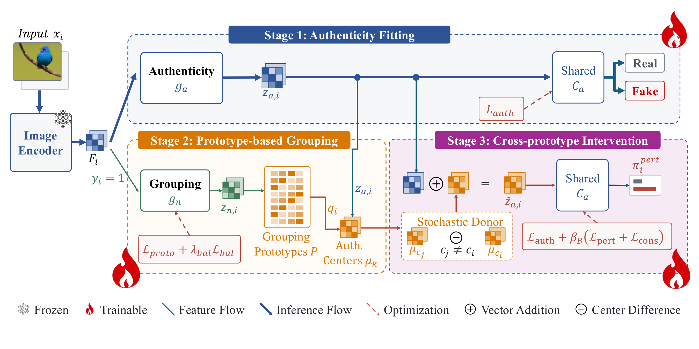

# CPID

**Cross-Prototype Intervention for Generalizable AI-Generated Image Detection**

This repository provides the CPID model implementation, training core, inference entry point, and method figure.

## Overview

AI-generated image detectors can learn correlations that change across image generators. CPID organizes generated samples into feature-space prototype groups and uses the group structure to construct controlled authenticity-space interventions. The detector is trained to preserve the real/fake decision under these cross-prototype changes.



## Architecture

The model uses a frozen CLIP vision encoder followed by two branches:

- **Authenticity branch:** maps image tokens to a representation for binary real/fake prediction.
- **Grouping branch:** maps generated samples to normalized features and assigns them to fake-only prototypes.

For a fake anchor, CPID selects a sample from another prototype group and translates the anchor using the difference between the corresponding authenticity-space centers. The translated feature shares the authenticity classifier with the original feature. Fake-target supervision and prediction consistency provide the intervention objectives.

The inference path retains only the authenticity route:

```text
image → frozen CLIP → authenticity encoder → real/fake classifier
```

## Code

- [train_main.py](train_main.py): model construction, prototype assignment, center-difference intervention, training losses, and optimization loop.
- [module/image_model.py](module/image_model.py): image representation and authenticity model.
- [module/prototypes.py](module/prototypes.py): EMA prototype bank.
- [infer.py](infer.py): single-image and directory inference.
- [figures/CPID_overview.pdf](figures/CPID_overview.pdf): method overview figure.

The training interface accepts frozen CLIP tokens with shape `[batch, 257, 1024]` and binary labels, where `0` denotes real images and `1` denotes generated images.

## Requirements

- Python 3.10+
- PyTorch 2.x
- torchvision
- transformers
- Pillow

```bash
pip install -r requirements.txt
```

The default vision backbone is `openai/clip-vit-large-patch14`.

## Inference

```bash
python infer.py \
  --input /path/to/image-or-directory \
  --checkpoint /path/to/checkpoint.pth
```

Native 224-pixel views are aggregated by averaging their logits before computing the fake probability. Use `--view center` for a single center view.

## License

See [LICENSE](LICENSE). The code is provided for non-commercial research use. Redistribution, commercial use, and submission of modified code as another person's work require written permission.
